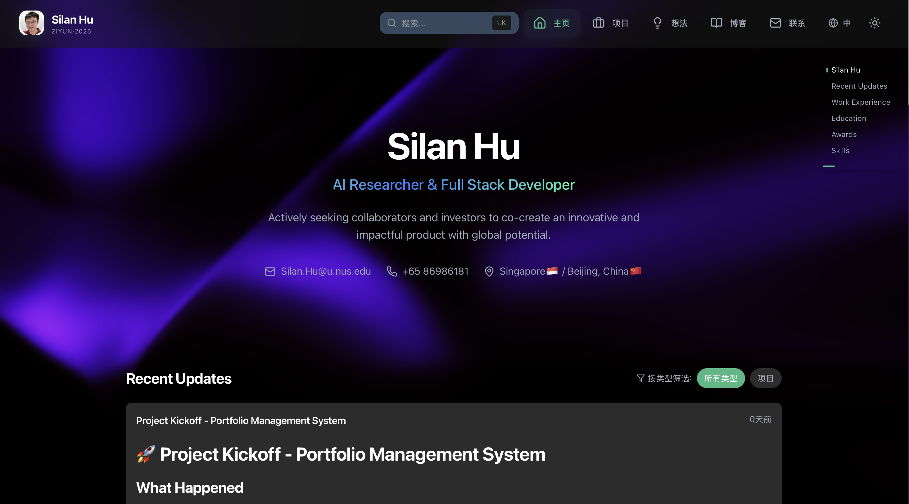

# Silan Personal Website - AI-Powered Portfolio Platform

A revolutionary full-stack personal website platform that transforms professional online presence through intelligent content management, modern web technologies, and automated workflows. Built for AI professionals, researchers, and full-stack developers who demand sophisticated yet maintainable digital presence.


**Live Demo**: [https://silan.tech](https://silan.tech)
**Source Code**: [https://github.com/Qingbolan/Silan-Personal-Website](https://github.com/Qingbolan/Silan-Personal-Website)



## Project Overview

The Silan Personal Website is a comprehensive full-stack platform that revolutionizes how technical professionals present themselves online. Unlike traditional portfolio sites, this platform combines intelligent content management with modern web technologies to create a seamless workflow from development to professional presentation.

### Key Highlights

- **Modern React Frontend** - Interactive UI with TypeScript, Tailwind CSS, Framer Motion, and Three.js
- **Go-Zero Backend** - Microservices architecture with Ent ORM for database management
- **Database Support** - MySQL, PostgreSQL, and SQLite with Ent ORM schema management
- **Python CLI Tools** - Intelligent content management and database synchronization
- **File-Based CMS** - Markdown-first approach with automated sync and frontmatter removal
- **Content Processing** - Intelligent project parsing, technology detection, and metadata extraction
- **Responsive Design** - Mobile-first with progressive enhancement
- **Multi-language Support** - i18n implementation (English/Chinese)
- **Metrics Collection** - Prometheus integration for monitoring
- **Authentication** - JWT-based authentication with Google OAuth support

## Architecture

### Tech Stack Overview

```
┌────────────────────────────────────────────────────────────────┐
│                      Frontend Layer                            │
│  React 18 + TypeScript + Vite + Tailwind CSS                  │
│  Framer Motion + Three.js + Ant Design + Recharts             │
│  CodeMirror + React Markdown + i18next                        │
└─────────────────┬──────────────────────────────────────────────┘
                  │ HTTP/REST API
                  ▼
┌────────────────────────────────────────────────────────────────┐
│                   Backend Services (Go)                        │
│              Go-Zero Framework (v1.5.6)                        │
│         Ent ORM + JWT Auth + Prometheus Metrics                │
└─────────────┬──────────────────┬─────────────────┬────────────┘
              │                  │                 │
              ▼                  ▼                 ▼
    ┌─────────────────┐  ┌──────────────┐  ┌─────────────────┐
    │  MySQL 8.0      │  │  PostgreSQL  │  │  SQLite (dev)   │
    │  (Production)   │  │  (Optional)  │  │  Local Cache    │
    └─────────────────┘  └──────────────┘  └─────────────────┘
              │
              ▼
    ┌─────────────────────────────────────────────────────────────┐
    │              Python CLI & Content Management                │
    │         File-based Markdown → Database Sync                 │
    │  Content Parsers + Frontmatter Processing + Sync Logic      │
    └─────────────────────────────────────────────────────────────┘
```

### Frontend Stack

- **React 18** - Component-based UI library
- **TypeScript** - Type-safe development
- **Vite** - Lightning-fast build tool
- **Tailwind CSS** - Utility-first styling
- **Framer Motion** - Smooth animations
- **Three.js / React Three Fiber** - 3D visualizations
- **Recharts** - Data visualization charts
- **Ant Design** - Enterprise UI components
- **React Router v6** - Client-side routing
- **i18next** - Internationalization
- **Axios** - HTTP client with interceptors

### Backend Stack

- **Go-Zero v1.5.6** - Microservices framework
- **Ent ORM v0.14.4** - Graph-based database schema and migrations
- **MySQL 8.0** - Primary relational database (production)
- **PostgreSQL** - Alternative database support
- **SQLite** - Local development and caching
- **JWT (golang-jwt/jwt v4)** - Stateless authentication
- **Prometheus** - Metrics collection and monitoring

### Python Content Management

- **Custom CLI** - Intelligent content scaffolding
- **Content Parsers** - Markdown + frontmatter processing
- **Database Sync** - Automated content-to-DB synchronization
- **Multi-format Support** - Blog, Project, Idea, Resume, Episode types
- **Frontmatter Removal** - Clean content extraction for README files

### DevOps & Infrastructure

- **Docker & Docker Compose** - Multi-service containerization
- **Prometheus** - Metrics collection and monitoring
- **GitHub** - Version control and collaboration
- **Local Development** - Direct service communication without reverse proxy

## What Makes This Special

### Developer-Centric Workflow

```bash
# Content Management CLI
silan init                          # Initialize new portfolio
silan new project "AI Platform"     # Create project structure
silan new blog "Tutorial Series"    # Create blog series
silan new idea "Research Concept"   # Document research ideas
silan sync                          # Sync content to database
silan list projects                 # View all projects
silan status                        # Check sync status
```

### Intelligent Content Processing

- **Automatic Metadata Extraction**: Parse README files and extract project information
- **Frontmatter Removal**: Clean extraction of markdown content (removes `---...---` metadata)
- **Technology Detection**: Identify frameworks from dependencies and code
- **Content Relationships**: Map connections between projects, skills, and ideas
- **Multi-format Support**: Handle Markdown, YAML frontmatter, and various content types
- **SEO Optimization**: Auto-generate meta tags and structured data

### Professional Presentation

- **Responsive Design**: Mobile-first with tablet and desktop optimization
- **Interactive Elements**: Smooth animations with Framer Motion, 3D graphics with Three.js
- **Rich Visualizations**: Data charts with Recharts, code highlighting with CodeMirror
- **Modern UI**: Ant Design components with Tailwind CSS styling
- **Markdown Support**: Full markdown rendering with syntax highlighting and math equations

### Advanced Features

- **Project Metrics**: View counts and like tracking with fingerprint-based user identification
- **Community Features**: Public message wall and project issue discussions
- **Content Filtering**: Filter by tags, categories, and technologies
- **Multi-language Content**: Full i18n support for English and Chinese
- **Rich Content Types**: Support for Projects, Blog, Ideas, Episodes, and Resume

## Project Structure

```
Silan-Personal-Website/
├── README.md                           # This file
├── License                             # Apache License 2.0
│
├── frontend/                           # React Frontend Application
│   ├── src/
│   │   ├── components/                 # React components
│   │   │   ├── Resume/                 # Resume components
│   │   │   ├── BlogStack/              # Blog system
│   │   │   ├── ProjectGallery/         # Project showcase
│   │   │   │   ├── ProjectDetail.tsx   # Project detail page
│   │   │   │   ├── ProjectTabs.tsx     # Tab navigation (README, Quick Start, etc.)
│   │   │   │   ├── ProjectCommunityFeedback.tsx
│   │   │   │   └── ProjectIssuesList.tsx
│   │   │   ├── IdeaPage/               # Research ideas
│   │   │   └── ui/                     # Reusable UI components
│   │   ├── api/                        # API integration
│   │   │   ├── projects/
│   │   │   │   └── projectApi.ts       # Project API with QuickStart handling
│   │   │   └── index.ts
│   │   ├── views/                      # Page components
│   │   ├── layout/                     # Layout components
│   │   ├── types/                      # TypeScript definitions
│   │   ├── utils/                      # Utilities
│   │   └── i18n/                       # Internationalization
│   ├── package.json                    # Frontend dependencies
│   ├── vite.config.ts                  # Vite configuration
│   ├── tailwind.config.js              # Tailwind CSS config
│   └── tsconfig.json                   # TypeScript config
│
├── backend/                            # Go Backend Services
│   ├── internal/
│   │   ├── config/                     # Service configuration
│   │   ├── handler/                    # HTTP request handlers
│   │   ├── logic/                      # Business logic
│   │   │   ├── resume/                 # Resume endpoints
│   │   │   ├── projects/               # Project endpoints
│   │   │   ├── blog/                   # Blog endpoints
│   │   │   └── ideas/                  # Ideas endpoints
│   │   ├── svc/                        # Service context
│   │   ├── types/                      # Go type definitions
│   │   ├── middleware/                 # HTTP middleware
│   │   └── ent/                        # Ent ORM
│   │       └── schema/                 # Database schema
│   │           ├── project.go          # Project entity
│   │           ├── projectdetail.go    # Project details
│   │           ├── blog.go             # Blog entity
│   │           ├── idea.go             # Idea entity
│   │           └── ...
│   ├── api/                            # API definitions (.api files)
│   ├── etc/                            # Configuration files
│   ├── go.mod                          # Go dependencies
│   └── docker-compose.yml              # Container orchestration
│
├── silan-personal-website/             # Python CLI & Content Management
│   ├── silan/
│   │   ├── cli/                        # CLI commands
│   │   ├── models/                     # Data models
│   │   ├── parsers/                    # Content parsers
│   │   │   ├── base_parser.py          # Base parser with _remove_frontmatter()
│   │   │   ├── project_parser.py       # Project content parser
│   │   │   ├── idea_parser.py          # Idea content parser
│   │   │   ├── blog_parser.py          # Blog content parser
│   │   │   └── episode_parser.py       # Episode/series parser
│   │   ├── logic/                      # Business logic
│   │   │   ├── database_sync_logic/    # DB synchronization
│   │   │   ├── content_scaffold_logic.py
│   │   │   └── project_init_logic/
│   │   ├── services/                   # Service layer
│   │   └── utils/                      # Utilities
│   ├── requirements.txt                # Python dependencies
│   ├── setup.py                        # Package setup
│   └── README.md                       # CLI documentation
│
├── silan-demo/                         # Demo Content Portfolio
│   ├── content/
│   │   ├── blog/                       # Blog posts and series
│   │   │   ├── silan-website-usage-guide/
│   │   │   ├── silan-website-idea-significance/
│   │   │   └── vlog.ai-coding-tutorial/
│   │   ├── projects/                   # Portfolio projects
│   │   │   └── silan-personal-website/
│   │   │       ├── README.md           # Project documentation
│   │   │       ├── QUICKSTART.md       # Quick start guide
│   │   │       ├── RELEASES.md         # Release notes
│   │   │       ├── DEPENDENCIES.md     # Dependencies
│   │   │       ├── LICENSE             # License file
│   │   │       └── .silan-cache        # Project metadata
│   │   ├── episode/                    # Tutorial series
│   │   │   └── portfolio-tutorial-series/
│   │   │       ├── README.md           # Series overview (with frontmatter)
│   │   │       ├── episode-01-setup.md
│   │   │       └── episode-02-content.md
│   │   ├── ideas/                      # Research ideas
│   │   │   └── silan-personal-website/
│   │   │       ├── README.md           # Idea abstract
│   │   │       ├── NOTES.md            # Progress notes
│   │   │       ├── REFERENCES.md       # References
│   │   │       └── results.md          # Results
│   │   ├── resume/                     # Professional info
│   │   │   └── resume.md
│   │   └── moment/                     # Timeline updates
│   ├── templates/                      # Content templates
│   └── silan.yaml                      # Portfolio config
│
├── public/                             # Static assets
├── docs/                               # Documentation
└── portfolio.db                        # SQLite cache (local dev)
```

## Quick Start

### Prerequisites

- **Node.js** 18+ and npm
- **Go** 1.23+
- **Python** 3.9+
- **Docker** and Docker Compose
- **MySQL** 8.0 (or use Docker)
- **Redis** (or use Docker)

### 1. Clone the Repository

```bash
git clone https://github.com/Qingbolan/Silan-Personal-Website.git
cd Silan-Personal-Website
```

### 2. Frontend Setup

```bash
cd frontend

# Install dependencies
npm install

# Start development server (http://localhost:5173)
npm run dev

# Build for production
npm run build

# Preview production build
npm run preview
```

### 3. Backend Setup (Go-Zero)

```bash
cd backend

# Install Go dependencies
go mod download

# Generate Ent code
go run -mod=mod entgo.io/ent/cmd/ent generate ./internal/ent/schema

# Configure database (edit etc/backend.yaml)
# Set MySQL and Redis connection details

# Start the server (http://localhost:8080)
go run backend.go
```

### 4. Python CLI Setup

```bash
cd silan-personal-website

# Create virtual environment
python -m venv venv
source venv/bin/activate  # On Windows: venv\Scripts\activate

# Install dependencies
pip install -r requirements.txt

# Install CLI tool
pip install -e .

# Verify installation
silan --help
```

### 5. Content Management Setup

```bash
# Navigate to demo content
cd silan-demo

# Initialize content
silan new project "My Portfolio" --title "My Amazing Project"
silan new blog "First Post" --title "Getting Started"
silan new idea "Research Idea" --title "AI Innovation"

# Sync to database
silan sync

# Check status
silan status

# List content
silan list projects
silan list blog
silan list ideas
```

### 6. Docker Setup (Optional)

```bash
cd backend

# Start services (if docker-compose.yml is configured)
docker-compose up -d

# View logs
docker-compose logs -f

# Stop services
docker-compose down
```

**Note**: Docker setup may need to be configured based on your deployment needs. The project primarily supports local development without Docker.

### 7. Environment Variables

Configure backend settings in `backend/etc/backend.yaml`:

```yaml
Name: silan-backend
Host: 0.0.0.0
Port: 8080

# Database Configuration
DataSource:
  Type: mysql  # or postgres, sqlite
  Host: localhost
  Port: 3306
  Database: silan_website
  Username: silan
  Password: your_password_here

# JWT Configuration
Auth:
  AccessSecret: your_jwt_secret_key_here
  AccessExpire: 3600

# Prometheus Metrics
Prometheus:
  Host: 0.0.0.0
  Port: 9090
  Path: /metrics
```

## Development

### Frontend Development

```bash
# Start dev server with hot reload
npm run dev

# Lint TypeScript/React code
npm run lint

# Auto-fix linting issues
npm run lint:fix

# Build optimized production bundle
npm run build

# Preview production build locally
npm run preview
```

### Backend Development

```bash
# Generate API from .api files
goctl api go -api api/backend.api -dir .

# Generate Ent ORM code from schema
go run -mod=mod entgo.io/ent/cmd/ent generate ./internal/ent/schema

# Run tests
go test ./...

# Run with coverage
go test -cover ./...

# Build production binary
go build -o bin/backend backend.go
```

### Python CLI Development

```bash
# Install in editable mode
pip install -e .

# Run tests
pytest

# Run with coverage
pytest --cov=silan

# Format code
black silan/

# Type checking
mypy silan/

# Lint
flake8 silan/
```

### Content Workflow

```bash
# Create new content
silan new project "My Project"      # Creates project structure
silan new blog "My Blog Post"       # Creates blog post
silan new idea "My Idea"            # Creates idea document
silan new episode "Tutorial Series" # Creates tutorial series

# Edit content (use your preferred editor)
code silan-demo/content/projects/my-project/README.md

# Sync to database
silan sync

# List content
silan list projects
silan list blog --filter status:published

# Check sync status
silan status
```

## Database Schema (Ent ORM)

### Core Entities

#### Projects
- `projects` - Basic project information (name, description, tags, status)
- `project_details` - Extended details (README content, QuickStart, Dependencies, Releases, License)
- `project_technologies` - Technology stack mappings
- `project_images` - Project screenshots and media
- `project_detail_translations` - Multi-language support

#### Blog
- `blog_posts` - Blog articles with metadata
- `blog_translations` - Multi-language support
- `blog_categories` - Blog categorization
- `blog_tags` - Blog tagging system

#### Ideas
- `ideas` - Research ideas and concepts
- `idea_details` - Detailed idea information (progress, results, references, estimated budget)

#### Episodes
- `episodes` - Tutorial/series episodes
- `episode_details` - Episode content and metadata

#### Resume
- `personal_info` - Personal information and contact details
- `education` - Education background
- `work_experience` - Professional experience
- `publications` - Academic publications
- `awards` - Professional awards

#### Community
- `public_messages` - Public message wall
- `project_issues` - Project-specific issues and discussions
- `project_comments` - Comments on projects

#### System
- `users` - User accounts and profiles
- `user_identities` - OAuth/Google authentication identities
- `project_metrics` - Project views and likes tracking

### Key Relationships

- **Projects** ↔ **ProjectDetail** (1:1)
- **Projects** ↔ **ProjectTechnology** (1:N)
- **Projects** ↔ **ProjectImages** (1:N)
- **BlogPosts** ↔ **BlogTranslations** (1:N)
- **Ideas** ↔ **IdeaDetail** (1:1)
- **User** ↔ **UserIdentity** (1:N)
- **Projects** ↔ **ProjectMetrics** (1:N via fingerprint tracking)

## API Endpoints

### Resume API

```
GET  /api/resume/data               - Complete resume data
GET  /api/resume/personal-info      - Personal information
GET  /api/resume/education          - Education history
GET  /api/resume/work-experience    - Work experience
GET  /api/resume/projects           - Projects list
GET  /api/resume/publications       - Publications
GET  /api/resume/awards             - Awards
```

### Blog API

```
GET  /api/blog/posts                - Blog posts (paginated)
GET  /api/blog/post/:id             - Single blog post
GET  /api/blog/categories           - Blog categories
GET  /api/blog/tags                 - Blog tags
GET  /api/blog/search?q=keyword     - Search posts
```

### Projects API

```
GET  /api/projects                  - Projects list
GET  /api/projects/:id              - Project details
POST /api/projects/:id/like         - Like project
POST /api/projects/:id/view         - Record view
GET  /api/projects/:id/metrics      - Project metrics
```

### Ideas API

```
GET  /api/ideas                     - Research ideas
GET  /api/ideas/:id                 - Idea details
GET  /api/ideas/categories          - Idea categories
```

### Community API

```
GET  /api/community/messages        - Public messages
POST /api/community/messages        - Post message
GET  /api/projects/:id/issues       - Project issues
POST /api/projects/:id/issues       - Create issue
```

## Deployment

### Production Deployment

```bash
# 1. Build frontend
cd frontend
npm run build
# Output will be in frontend/dist/

# 2. Build backend
cd ../backend
go build -o bin/backend backend.go

# 3. Configure database (MySQL/PostgreSQL)
# Edit backend/etc/backend.yaml with production database credentials

# 4. Run backend
./bin/backend -f etc/backend.yaml

# 5. Serve frontend (use any static file server)
# Examples:
# - nginx
# - Apache
# - Node.js serve
# - Cloud static hosting (Vercel, Netlify, etc.)
```

### API Endpoints

Access the backend services:

- **Backend API**: http://localhost:8080/api
- **Prometheus Metrics**: http://localhost:9090/metrics (if Prometheus is configured)

## Performance

- **Frontend**: React 18 with Vite for fast builds and hot module replacement
- **Bundle Size**: Code splitting and lazy loading for optimized delivery
- **API**: RESTful endpoints with efficient database queries
- **Database**: Ent ORM with optimized schema and relationships

## Testing

### Backend Tests
```bash
cd backend
go test ./...
go test -cover ./...
```

### Python CLI Tests
```bash
cd silan-personal-website
pytest
pytest --cov=silan
```

**Note**: Frontend testing suite can be configured based on project needs.

## Recent Updates

### Latest Features

- ✅ **Frontmatter Removal**: Parser automatically removes YAML frontmatter from README files
- ✅ **QuickStart Tab**: Conditionally rendered based on backend data availability
- ✅ **Dynamic Content**: No hardcoded defaults, clean empty states
- ✅ **Multi-language Episodes**: Full support for tutorial series with README overview
- ✅ **Enhanced Parsers**: `_remove_frontmatter()` in base_parser for clean extraction

### Bug Fixes

- 🐛 Fixed README.md frontmatter causing empty title in episode series
- 🐛 Fixed QuickStart tab showing default values when no backend data
- 🐛 Fixed project/idea parsers including `---...---` in abstract/detailed_description

## Contributing

Contributions are welcome! Please follow these steps:

1. Fork the repository
2. Create a feature branch (`git checkout -b feature/amazing-feature`)
3. Commit your changes (`git commit -m 'Add amazing feature'`)
4. Push to the branch (`git push origin feature/amazing-feature`)
5. Open a Pull Request

### Development Guidelines

- Follow TypeScript/Go/Python best practices
- Write tests for new features
- Update documentation
- Follow conventional commits format
- Ensure all tests pass before submitting PR

## License

This project is licensed under the Apache License 2.0 - see the [License](License) file for details.

## Author

**Silan Hu** - AI Researcher & Full Stack Developer

- Website: [silan.tech](https://silan.tech/)
- GitHub: [@Qingbolan](https://github.com/Qingbolan)
- Email: contact@silan.tech
- LinkedIn: [Silan Hu](https://linkedin.com/in/Qingbolan)

## Acknowledgments

### Technologies & Frameworks

- **Go-Zero** - Excellent microservices framework
- **Ent ORM** - Powerful graph-based ORM for Go
- **React** - Modern UI library
- **Vite** - Lightning-fast build tool
- **Tailwind CSS** - Utility-first CSS framework
- **Framer Motion** - Beautiful animations library
- **Docker** - Containerization platform

### Inspirations

- Modern portfolio designs and best practices
- Open source content management systems
- Developer-first tooling philosophy

### Community

- All open source contributors
- Go, React, and Python communities
- Early testers and feedback providers

---

**If you find this project helpful, please give it a star!**

**Questions or suggestions? [Open an issue](https://github.com/Qingbolan/Silan-Personal-Website/issues) or reach out!**
