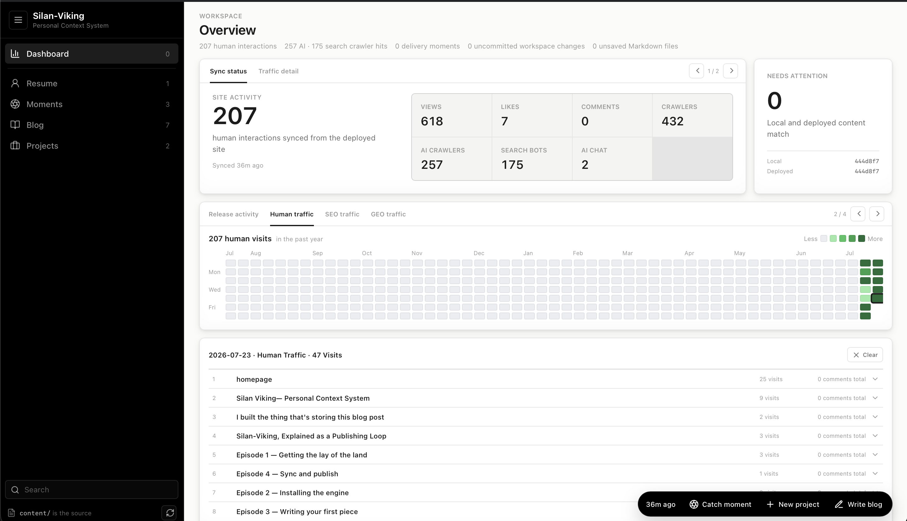

# Silan Viking -- Make Research Work Findable

**AI is now in the loop of research—from related-work discovery to paper understanding and peer review. Publishing a paper is no longer enough. Researchers need their work to be continuously discoverable, understandable, and verifiable by both people and AI.** However, researchers still lack a dedicated workspace to consolidate their academic assets and continuously publish them as structured, AI-readable research knowledge.

Silan Viking is a local-first workspace that transforms every research update into a complete, structured, and evidence-backed academic presence—keeping your work consistent across papers, project pages, researcher profiles, AI/search metadata, and every public representation



[](https://github.com/Qingbolan/Silan-Context-System)
[](https://github.com/Qingbolan/Silan-Context-System/releases/tag/v1.0.0)
[](License)
[](engine/)
[](desktop/)
[](docs/silan-viking/03-mcp-service.md)

- **Example public output:** [silan.tech](https://silan.tech)
- **Product page:** [silan.tech/projects/silan-viking](https://silan.tech/projects/silan-viking/)
- **Practical guide:** [Using Silan Viking](https://silan.tech/episodes/getting-the-lay-of-the-land/)
- **Latest release:** [v1.0.0](https://github.com/Qingbolan/Silan-Context-System/releases/tag/v1.0.0)

The desktop workbench is the control surface; the website is one public output
of the system, not the product itself.

## The Research Update Problem

Silan Viking begins with an AI, ML, or systems researcher who already has work
to show and recurring public-record maintenance pressure. The current operator
is comfortable with Markdown/Git and self-hosted tooling, but that is the
current onboarding constraint rather than the long-term ceiling. The trigger
is concrete: an experiment changes the conclusion, a paper is accepted, a
release ships, or a résumé claim gains better evidence.

The same fact now needs several honest forms:

- a dated private note while the context is fresh;
- an article that explains the evidence and uncertainty;
- a project update that places it in the larger line of work;
- a résumé statement that compresses the contribution;
- a public page with a stable URL, summary, language metadata, and related
  links.

Silan Viking does not force one paragraph onto every surface and does not
silently rewrite them. It gives each record a stable identity, connects the
records, and keeps their review and publication states visible.

## One Research Update, One Reviewable Workflow

```text
capture -> structure -> connect -> review -> publish -> deploy -> verify
```

1. **Capture.** Save the first useful sentence as a dated moment by typing or
   dictating it.
2. **Structure.** Turn it into a private article or project update while the
   evidence and uncertainty are still close.
3. **Connect.** Link the article, project, moment, and résumé evidence instead
   of maintaining consistency by copy and paste.
4. **Review.** Edit the rendered page or inspect an Agent proposal and its
   source diff.
5. **Publish.** Move the reviewed item from private source to an explicitly
   public content state.
6. **Deploy.** Project the reviewed source into the public site through a
   separate, explicit operation.
7. **Verify.** Check that the intended content version reached the site, then
   observe human visits and classified crawler requests as diagnostic signals.

The practical value is not "more content." It is a shorter and more reliable
round trip from new evidence to an accurate public explanation.

## Release and Main-Branch Boundary

The public `v1.0.0` release provides the CLI foundation: initialize a
workspace, manage the earlier `idea` / `update` / article / project / episode /
résumé schema, validate and index source, use relations and proposals, and run
the site/MCP adapters.

The current main branch contains post-release work used by silan.tech,
including the renamed Moment model, the Tauri desktop workbench, guided
onboarding, dictation, richer delivery checks, and the current screenshots.
Those capabilities require a source build until a newer release is published.
The quickstart below intentionally uses commands available in the public
release.

## What Works in the Current Source

| Surface | Current boundary |
| --- | --- |
| Content | Versioned Markdown/TOML for moments, articles, projects, episode series, media, and résumé data |
| Editing | Main-branch CLI plus a source-checkout Tauri/React desktop workbench with structured editing, dictation, media, and language variants |
| Relationships | Stable `silan://` identities and typed links between related records |
| Validation | Schema checks, source linting, a rebuildable SQLite projection, and guided next steps |
| Publication | Explicit private/public state, local preview, and configured Docker deployment |
| Machine readability | Stable routes, summaries, structured data, sitemap, robots rules, `llms.txt`, and language metadata for discovery hygiene, not ranking or citation proof |
| Observation | Deployed-version checks, human activity, comments, and heuristic search/AI crawler attribution |
| Agent help | MCP operations over the Silan content workspace and reviewable change proposals |
| Cross-machine work | Git is the supported source synchronization path |

Two boundaries matter:

- A crawler request proves that a URL was requested. It does **not** prove
  indexing, understanding, ranking, or citation.
- The desktop workbench and current Moment/onboarding command surface run from
  the source checkout. Packaged desktop onboarding, a post-v1.0 release, and
  direct cross-device synchronization are still in progress.

## Start With One Postponed Result

Install the released CLI on macOS or Linux:

```sh
curl -fsSL https://raw.githubusercontent.com/Qingbolan/Silan-Context-System/main/engine/install.sh | sh
silan --version
```

The installer exposes equivalent commands at `silan`, `svk`, and
`silan-viking`. The examples use `silan`.

Create a workspace and one private article:

```sh
mkdir my-research-site
cd my-research-site

silan init
silan blog new new-research-result
silan content lint
silan index sync
silan blog show new-research-result
```

Edit:

```text
content/resources/blog/new-research-result/parts/body/en.md
```

Lead with four things: what changed, why it matters, what evidence supports
it, and what remains uncertain. Linting and indexing do not publish the item.

When the claim is ready:

```sh
silan blog publish new-research-result
silan content lint
silan index sync
```

Local site preview needs Docker. The first command prints the plan; the second
executes it:

```sh
silan site preview
silan site preview --confirm
```

Production deployment needs an explicit `[deploy]` configuration, credentials,
a reachable host, and Docker on the target:

```sh
silan site deploy --dry-run
silan site deploy --confirm
```

The v1.0.0 Linux binary supports the CLI authoring and validation path above,
but its release archive does not include every production deployment artifact.
Use a full source checkout for that deployment path.

See [engine/INSTALL.md](engine/INSTALL.md) for supported targets, version
pinning, checksums, installation directories, and uninstall instructions.

## Silan Viking Desktop

Silan Viking Desktop is the working authoring and operations surface over this
repository's content workspace. It can edit articles and résumé parts, capture
moments, manage media and language variants, inspect publication state, and
compare local and deployed content.

From a full source checkout:

```sh
./engine/target/debug/silan-viking desktop
```

The CLI injects the content and database paths expected by the Tauri app.
Running `desktop/` directly is a development workflow and requires the
corresponding environment variables.

## Owner-Reviewed Agent Help

Agent integration is useful for bounded work inside the Silan content
workspace: find related records, draft a project update, prepare another
language, add a missing relation, or report which content records appear
stale.

```sh
silan skill emit
silan mcp serve --stdio

silan proposal list
silan proposal show <id>
silan proposal accept <id>
```

The default authority boundary is deliberate:

- the Agent can read, recall, capture, and prepare a proposal;
- the owner inspects and accepts source changes;
- publication and production deployment remain separate owner actions.

In short: an Agent has proposal authority, not publication authority.

## System Shape

Markdown/TOML and media in `content/` are the authored source of truth. The
SQLite database, API, public website, sitemap, structured metadata, and
`llms.txt` are derived outputs and can be rebuilt.

```text
content/                         authored source
  resources/
    blog/
    projects/
    episode/
    moment/
    resume/

engine/                          Silan Viking Engine: model, CLI, MCP, delivery
desktop/                         Silan Viking Desktop: Tauri + React workbench
backend/                         runtime insights and public API
frontend/                        Silan Viking Site: public and machine-readable output
```

This separation gives Git a useful role: review, provenance, rollback, and
cross-machine transport remain ordinary file operations rather than hidden
database state.

## Product Boundary

The current product category is a **local-first research publishing
workspace**. Silan Viking is for a technical researcher who wants to maintain
an evolving public body of work and accepts a self-hosted toolchain. It is not:

- a general-purpose note-taking app;
- a team CMS or enterprise SEO/GEO suite;
- a generic personal-context or Agent-memory database;
- a one-click hosted academic website;
- proof that a crawler understood or cited a page;
- an autonomous Agent with authority to publish private work.

The longer-term category hypothesis is **Research Presence OS**: a system of
record for research evidence, public claims, review history, and deployed
versions. `Personal Context System` describes the underlying architecture; it
is not the primary user-facing category. Research Presence OS only earns its
name if repeated real updates become faster, more consistent, and safer than
the current Markdown/Git or CMS workflow.

## Documentation

- [Product positioning and fact boundary](docs/silan-viking/POSITIONING.md)
- [Technical overview](docs/TECHNICAL-OVERVIEW.md)
- [Vision and success criteria](docs/VISION.md)
- [Silan Viking design documents](docs/silan-viking/README.md)
- [Docker and desktop E2E report](docs/silan-viking/e2e-reports/2026-07-24-docker-preview-and-desktop.md)

## Contributing

1. Fork the repository.
2. Branch from `main`.
3. Use conventional commit prefixes such as `feat`, `fix`, `docs`, or
   `chore`.
4. Open a pull request with a `## Test plan`.

## License

Apache License 2.0. See [License](License).

## Author

**Silan Hu** — NUS Computer Science PhD student and AI systems researcher

- Website: [silan.tech](https://silan.tech)
- GitHub: [@Qingbolan](https://github.com/Qingbolan)
- Email: [silan.hu@comp.nus.edu.sg](mailto:silan.hu@comp.nus.edu.sg)
