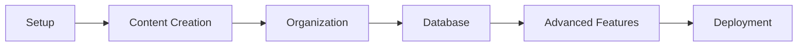

# Portfolio Tutorial Series

A comprehensive, hands-on tutorial series for building and managing your professional portfolio using Silan.

## 🎯 Series Overview

This tutorial series takes you from zero to hero in portfolio management. Whether you're a developer, designer, or creative professional, you'll learn to create, organize, and maintain a stunning portfolio that showcases your work effectively.

## 📚 What You'll Build

By the end of this series, you'll have:
- A fully functional portfolio management system
- Rich, well-organized content showcasing your projects
- Automated workflows for content updates
- Database integration for content synchronization
- A deployment-ready portfolio website

## 🗓️ Series Structure

### 🚀 **Episode 1: Setting Up Your Portfolio Project** (15 min)
- Install and configure Silan
- Initialize your first portfolio project
- Understand the project structure
- Create your first piece of content

### 📝 **Episode 2: Creating Rich Content** (20 min)
- Master advanced Markdown formatting
- Add images, videos, and interactive content
- Use frontmatter for metadata management
- Create compelling project documentation

### 🗂️ **Episode 3: Content Organization** (18 min)
- Organize content with categories and tags
- Create content relationships and cross-references
- Build content hierarchies
- Set up content templates

### 🗄️ **Episode 4: Database Integration** (25 min)
- Configure database connections
- Sync content to database automatically
- Query and search your content
- Set up content backup strategies

### ⚡ **Episode 5: Advanced Features** (30 min)
- Automate content workflows
- Build custom content types
- Integrate with external APIs
- Deploy your portfolio

## 🎓 Learning Path

## 👥 Who This Is For

### Primary Audience
- **Software Developers** building technical portfolios
- **Designers** showcasing creative work
- **Product Managers** documenting project experiences
- **Freelancers** creating professional presentations

### Prerequisites
- Basic command line knowledge
- Familiarity with Markdown
- Git basics (helpful but not required)
- Text editor of choice

### Difficulty Levels
- **Episodes 1-2**: Beginner friendly
- **Episodes 3-4**: Intermediate concepts
- **Episode 5**: Advanced techniques

## 🛠️ Tools You'll Need

### Required
- Computer with Python 3.8+
- Terminal/Command prompt access
- Text editor (VS Code, Sublime, etc.)
- Internet connection

### Optional
- Git for version control
- Database system (PostgreSQL, MySQL, or SQLite)
- Image editing software
- Screen recording tool (for demos)

## 📁 Resources

### Downloads
- [Episode Workbook (PDF)](./resources/workbook.pdf)
- [Sample Projects](./resources/sample-projects.zip)
- [Configuration Templates](./resources/templates.zip)

### Reference Materials
- [Silan CLI Documentation](https://docs.silan.dev)
- [Markdown Quick Reference](https://www.markdownguide.org/cheat-sheet/)
- [YAML Syntax Guide](https://yaml.org/spec/1.2/spec.html)

### Community
- [Discord Community](https://discord.gg/silan)
- [GitHub Discussions](https://github.com/silan/discussions)
- [Tutorial Forum](https://forum.silan.dev/tutorials)

## 🏁 Getting Started

1. **Watch Episode 1** to set up your environment
2. **Follow along** with the hands-on exercises
3. **Join the community** for support and discussion
4. **Share your progress** using #SilanTutorial

## 📈 Progress Tracking

Track your progress through the series:

- [ ] Episode 1: Environment Setup
- [ ] Episode 2: Content Creation
- [ ] Episode 3: Content Organization
- [ ] Episode 4: Database Integration
- [ ] Episode 5: Advanced Features

## 🤝 Get Help

Stuck on something? Here's how to get help:

1. **Check the FAQ** in each episode
2. **Search the community forum**
3. **Ask in Discord** (#tutorial-help channel)
4. **Create a GitHub issue** for technical problems

## 🎉 What's Next?

After completing this series, consider:
- **Advanced Portfolio Techniques** (coming soon)
- **Team Portfolio Management** (coming soon)
- **Portfolio Analytics and Optimization** (coming soon)

---

**Created**: 2025-09-23
**Last Updated**: 2025-09-23
**Series Status**: Active
**Estimated Total Time**: 3 hours

Ready to begin? Start with [Episode 1: Setting Up Your Portfolio Project](episode-01-setup.md)!
